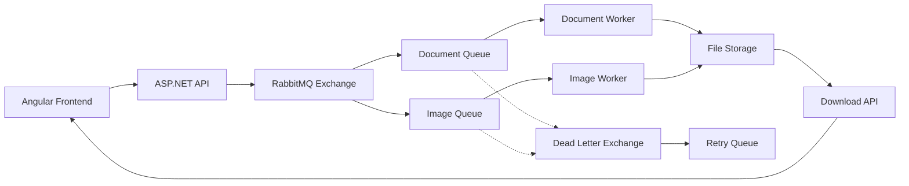

# 🖼️ SmartDocs - Async Document Converter & Image Processor

A modern web application built with **ASP.NET Core 9** and **Angular 19** that leverages **RabbitMQ** for asynchronous document and image processing. Users can upload files, choose transformations, and receive processed results through a clean, responsive interface.


## 🚀 Key Features

- **Asynchronous Processing**: All file conversions happen in background workers via RabbitMQ
- **Multiple File Operations**: Convert to PDF, resize images, add watermarks, format conversion
- **Real-time Status Updates**: Live job tracking with automatic polling
- **Scalable Architecture**: Microservices-ready with message queue architecture
- **Clean UI**: Modern Angular frontend with responsive design
- **Error Handling**: Robust error handling with dead letter queues and retry mechanisms

## 🧠 RabbitMQ Architecture & Workflow

### Core RabbitMQ Concepts Implemented

| Concept | Implementation |
|---------|----------------|
| **Producer/Consumer** | API acts as producer, background workers as consumers |
| **Work Queues** | Each file processing job is queued for async execution |
| **Direct Exchange** | Different job types route to specific worker queues |
| **Message Durability** | Messages persist through server restarts |
| **Acknowledgments** | Jobs only removed after successful processing |
| **Dead Letter Queue** | Failed jobs automatically retry or go to error queue |
| **QoS (Quality of Service)** | Workers process one job at a time for reliability |

### Message Flow Architecture



### Detailed Workflow

#### 1. **File Upload & Job Creation**
```
User uploads file → API saves to storage → Creates JobInfo → Publishes message to RabbitMQ
```

#### 2. **Smart Queue Routing**
```csharp
// Queue routing logic
JobType.ConvertToPDF → "document_processing" queue → DocumentProcessorWorker
JobType.ResizeImage → "image_processing" queue → ImageProcessorWorker  
JobType.AddWatermark → "image_processing" queue → ImageProcessorWorker
```

#### 3. **Async Message Processing**
```
Worker picks up message → Updates status to "Processing" → Processes file → Saves result → Updates status to "Completed"
```

#### 4. **Error Handling & Resilience**
```
Processing fails → Message goes to Dead Letter Queue → Automatic retry logic → Final error status if max retries exceeded
```

## 🏗️ Technical Architecture

### Backend (ASP.NET Core 9)
- **Controllers**: RESTful API endpoints for file operations
- **Services**: 
  - `RabbitMQService`: Message publishing and connection management
  - `JobStatusService`: In-memory job tracking (no database required)
  - `FileStorageService`: Local file system operations
- **Background Workers**: 
  - `DocumentProcessorWorker`: PDF conversion using iText7
  - `ImageProcessorWorker`: Image operations using ImageSharp
- **Models**: Strong-typed DTOs for API and message contracts

### Frontend (Angular 19)
- **Standalone Components**: Modern Angular architecture
- **Reactive Forms**: File upload with dynamic form fields
- **HTTP Client**: API communication with proper error handling
- **Real-time Updates**: Automatic job status polling
- **File Download**: Blob handling for processed file downloads

### Message Queue (RabbitMQ)
- **Exchanges**: Direct exchange for job type routing
- **Queues**: Durable queues with dead letter configuration
- **Workers**: Multiple background services consuming different queues
- **Monitoring**: Management UI for queue inspection

## 🛠️ Technology Stack

| Layer | Technology | Purpose |
|-------|------------|---------|
| **Frontend** | Angular 19 | SPA with reactive UI |
| **Backend** | ASP.NET Core 9 | REST API and background services |
| **Message Queue** | RabbitMQ | Async job processing |
| **File Processing** | iText7, ImageSharp | PDF/Image manipulation |
| **Deployment** | Docker | Containerized RabbitMQ |

## 📋 Prerequisites

- **.NET 9 SDK**
- **Node.js 18+** and **Angular CLI**
- **Docker Desktop** (for RabbitMQ)


### Supported File Operations
- **Convert to PDF**: Transform images to PDF documents
- **Resize Image**: Scale images to custom dimensions
- **Add Watermark**: Overlay text on images
- **Format Conversion**: Convert between JPG/PNG formats


## 🙏 Acknowledgments

- **RabbitMQ** for robust message queuing
- **iText7** for PDF processing capabilities
- **ImageSharp** for cross-platform image manipulation
- **ASP.NET Core** and **Angular** teams for excellent frameworks
